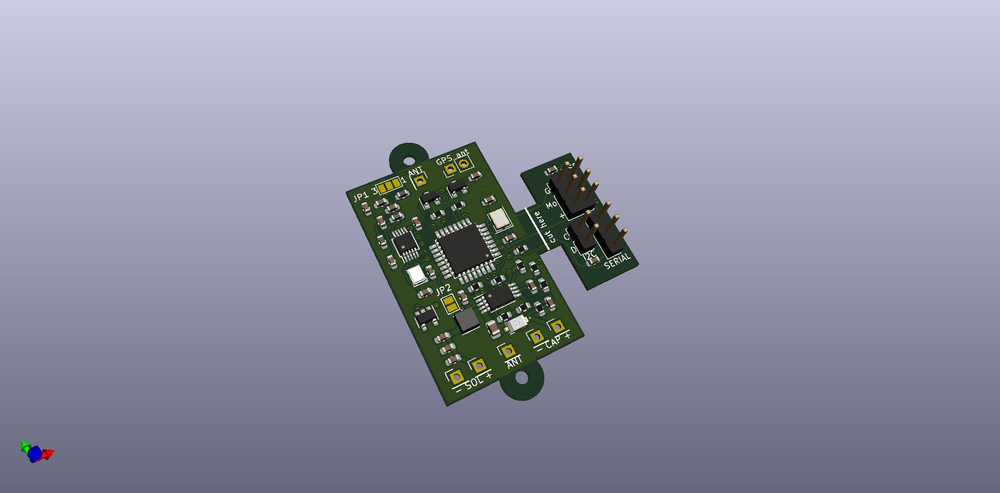

# HABakuk Pico Balloon Tracker Board

## Introduction:

Design of this board is based on excelent Alain's (K1FM) [K1FM-Pico-Balloon version 1.3](https://github.com/adecarolis).  Why I didn't use Alain's board directly and made my own PCB forked from his design? I was thinking about WSPR balloon tracker design for a long time (approximately 2-3 years) and I wanted simple board with ATmega328, Si5351 and Ublox GPS with possibility to switch peripheries off. From the board designs I found on the Internet, K1FM board met my original ideas the most but:  
- I wanted to power the board by solar panels via MPPT regulator (theorethicaly only two 50 x 25 mm panels would be enought to supply the board)
- I wanted the HF filter, but bypassable to test if the signal penetration is better with or without the filter 
- I'm designing my boards in KiCAD now, so I wanted to redraw the design completely (it is better than trying to import Eagle files) 

## Board construction:
The board includes MPPT power converter based on the SPV1040 chip and the values of the discrete components around it are calculated using [STMicroelectronics eDesignSuite](https://eds.st.com/photovoltaic/) using input parameters Voc = 1200 mV, Imp = 500 mA (measured on two solar panels in series) and Vmp = 930 mV, Imp = 450 mA (my estimation). There is connector for THT electrolytic capacitor serving as the energy store on the board. 

HF filter can be bypassed using **JP1** by scratching off solder jumper contact 1 (which is bridged on PCB by default) and soldering contact 3. 

I'm not sure if the measurement of solar panel voltage by the ATmega will not interfere with the SPV1040 power converter function, so I placed **JP2** on the board (bridged by default) which can be easily scratched off to break the (solar panel -> AD converter input) connection in the case of any problems.
                                                                                                          
The board is designed as 4 layers (only 3 layers used) thin PCB (it has thicknes of 0.8 mm only to reduce the weight of the PCB). Also there is filled zone (GND) only on one side of the board to reduce the weight. All the components except the Ublox GPS module are placed on the top side of the board to make the reflow soldering possible in the amateur conditions.  GPS module on the back side of the board should be soldered as the last component by the soldering iron.      

## Software: 
The recommended softwares are [OrionWSPR](https://github.com/ve3wmb/OrionWspr) or [GeminiWSPR](https://github.com/adecarolis/GeminiWspr)

## Production and real tests
The board will be ordered in [LJCPCB](https://jlcpcb.com/) and I will add here the link to reorder it.

**The board was not yet produced nor tested!** 

Jakub Šerých, serych@panska.cz, [https://jakub.serych.cz](https://jakub.serych.cz) (web only in Czech language)

